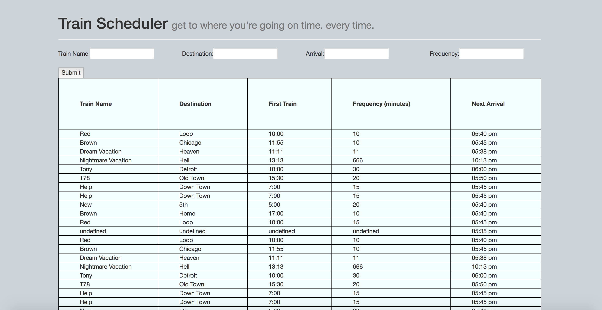

# Train-Scheduler

A train schedule application that incorporates Firebase to host arrival and departure data.

## Instructions

* Look for the desired train to find departure/arrival times.
* Add new train data and see real-time departure/arrival updates.

## Tools and Software

* [JQuery](https://jquery.com/)
* [Bootstrap](https://getbootstrap.com/)
* [Firebase](https://firebase.google.com/)

# Authors

* [Peter Juffernbruch](https://github.com/peterjuff)

# Acknowledgments

* [Northwestern University Coding Bootcamp](https://bootcamp.northwestern.edu/coding/)
* Homework week seven